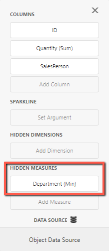

<!-- default badges list -->

[](https://supportcenter.devexpress.com/ticket/details/T987287)
[](https://docs.devexpress.com/GeneralInformation/403183)
<!-- default badges end -->


# Dashboard for ASP.NET Core - How to Access Hidden Field Values

The following example shows how to access the data source field's values when these values are not displayed in the dashboard item. The control gets data when a user clicks the corresponding item.

For example, you need to redirect the user to the specific web page based on the `Department` field value when the corresponding item is clicked. In this scenario you can use [Underlying and Displayed Data](https://docs.devexpress.com/Dashboard/403003/web-dashboard/dashboard-control-for-javascript-applications-jquery-knockout-etc/obtain-underlying-and-displayed-data) API in the [ViewerApiExtension.itemClick](https://docs.devexpress.com/Dashboard/js-DevExpress.Dashboard.ViewerApiExtensionOptions?p=netframework#js_devexpress_dashboard_viewerapiextensionoptions_onitemclick) event handler. Put the `Department` field to the "HIDDEN MEASURES" section and set its summary type to `Min` or `Max`:



After that, you can call the [ItemData.getMeasureValue](https://docs.devexpress.com/Dashboard/js-DevExpress.Dashboard.Data.ItemData#js_devexpress_dashboard_data_itemdata_getmeasurevalue_measureid_) method to obtain summary values for hidden measures:

```js
var departmentMeasureValue = dataSlice.getMeasureValue(departmentMeasure.id);
var departmentValue = departmentMeasureValue.getValue();
```

## Files to Review

* [Index.cshtml](./CS/Views/Home/Index.cshtml)

## Documentation

- [Underlying and Displayed Data](https://docs.devexpress.com/Dashboard/403003/web-dashboard/dashboard-control-for-javascript-applications-jquery-knockout-etc/obtain-underlying-and-displayed-data)

## More Examples

- [Dashboard for ASP.NET Core - How to obtain a dashboard item's client data](https://github.com/DevExpress-Examples/asp-net-core-dashboard-get-client-data)
- [Dashboard for ASP.NET Core - How to obtain a dashboard item's underlying data for a clicked visual element](https://github.com/DevExpress-Examples/asp-net-core-dashboard-get-underlying-data-for-clicked-item)
- [Dashboard for ASP.NET Core - How to obtain underlying data for the specified dashboard item](https://github.com/DevExpress-Examples/asp-net-core-dashboard-display-item-underlying-data)